# serviceWorker

是浏览器在后台**独立于网页**运行的脚本，一个单独的worker线程，拥有自己独立的 worker context.

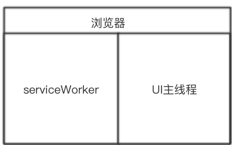

也可以理解为一种网络代理服务器，可编程拦截代理请求和返回，缓存文件。


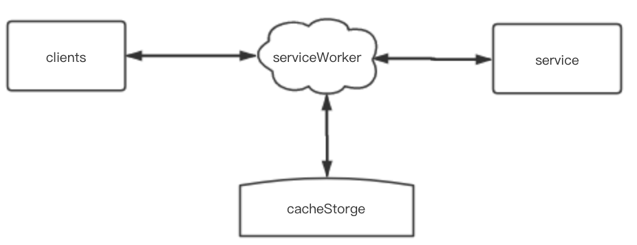


####  

再回来看下，PWA的缓存原理

核心就是浏览器的serviceWorker另启一个线程，这个线程负责去监听所有https请求（注意是https）,当发现某些资源是需要缓存下来的他会把资源拉取到浏览器本地，访问的时候拦截请求，不走网络请求，直接读取本地资源。这样资源相当于都是用户本地的资源,响应速度肯定飞快，还有就是资源都在用户浏览器里面，就算断了网,资源也都是能正常访问。


####特性

1 不能**直接**操作DOM；

2 必须在https环境下工作(本地环境除外)；

3 支持离线体验，开发者能够全面控制缓存文件以及页面所发送网络请求的处理方式；

**4 不用时会被中止，并在下次有需要时重启；**

5  广泛地利用了 promise；

6 拥有固定的生命周期(下文详述)；


#### 生命周期

Service Worker 的生命周期**完全独立于网页**。

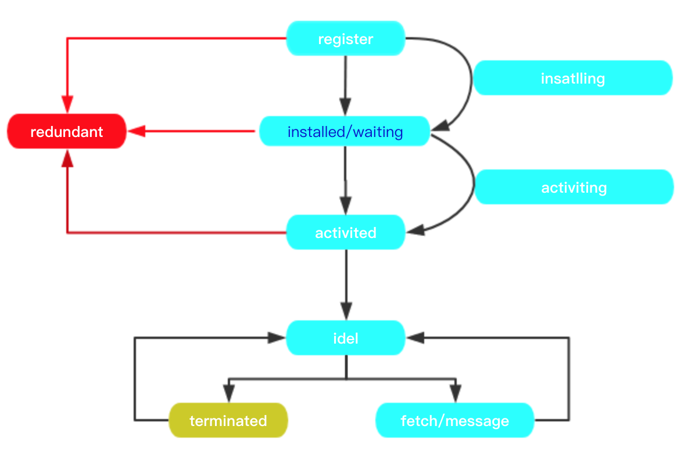

#####首次注册

1 首先在UI主线程的javascript中注册serverWoker,serviceWorker将会在浏览器后台开启服务工作线程；

2 若解析serviceWorker脚本发生错误，则进入失败`redundant`状态；

3 若解析注册顺利完成，进入` installing` 状态，这里常常用于处理缓存某些静态文件。

4 若文件均已成功缓存，那么 Service Worker  就安装完毕,进入 ` installed`状态;

5 若缓存过程中，任何文件下载失败，那么安装过程就会失败，Service Worker 就无法激活；(如果发生这种情况，不必担心，它下次会再试一次）。

6 安装成功后，进入 `activiting `状态，这是管理旧缓存的绝佳机会；

Service Worker 将会**对其作用域内**的所有页面实施控制，不过，首次注册该 Service Worker 的页面需要**再次**加载才会受其控制。 服务工作线程实施控制后，它将处于以下两种状态之一：服务工作线程终止以节省内存，或处理获取和消息事件，从页面发出网络请求或消息后将会出现后一种状态。


##### 更新

1 当修改serviceWorker注册的脚本，用户重新进入页面，浏览器会尝试在后台重新下载定义 Service Worker 的脚本文件。 如果 Service Worker 文件与其当前**所用文件存在字节差异**，则将其视为*新 Service Worker*。

2 新 Service Worker 将会启动，且将会触发 `install` 事件， 此时，旧 Service Worker 仍控制着当前页面，因此新 Service Worker 将进入 `waiting` 状态。

3 存在下列几种情况之一的时候，旧 Service Worker 将会被终止，新 Service Worker 将会取得控制权

- 当前没有激活的 worker
- 如果在 Service Worker 的脚本中 `self.skipWaiting()` 被调用
- 如果用户访问其他页面并释放了之前激活的 worker
- 在一个特定的时间(24小时)过去后，之前一个激活的 worker 被释放

4 新 Service Worker 取得控制权后，将会触发其 `activate` 事件。


 **存在下列几种情况之一的时候,service Worker 将进入 redundant状态**

- **处于 installing 状态时安装失败**
- **处于 activating 状态时激活失败**
- **一个新的 Service Worker 代替了它称为了激活的 Service Worker**


#### 浏览器兼容性

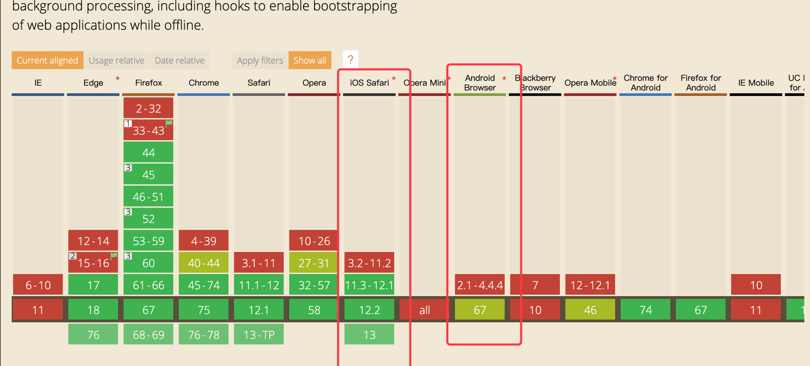

#### chrome调试

参考文档：[如何进行 Service Worker 调试](https://lavas.baidu.com/pwa/offline-and-cache-loading/service-worker/service-worker-debug)

###### 备注：简单演示一下下~~~ 

###workbox

一个为网页应用添加离线支持的 JavaScript 库， PWA 相关的工具集合。

Google 官方的 PWA 框架，它解决的就是**用底层 API 写 PWA 太过复杂的问题**。这里说的底层 API，指的就是去监听 SW 的 install、active、 fetch 事件做相应逻辑处理等

######备注：在这里 带领大家简单看下底层API调用

####简单使用：无需install安装 直接使用

看一下 [官网](https://developers.google.com/web/tools/workbox/)

Workbox 作为 SW 模块使用，提供了两个最主要的接口：

- `workbox.routing.registerRoute`，接受两个参数，第一个参数 capture 是正则表达式或 Express 风格的路由字符串，声明需要匹配那些请求，第二个参数用于告诉 Workbox 对前面拦截到的请求做何处理。

- `workbox.strategies.xxx`，用在 registerRoute 的第二个参数，表明使用何种缓存策略(即前文提到的PWA的五种缓存策略)。

  

#####进入本次分享的重点，开始编程

UI 主线程 main.js

用于注册SW

```
   //检查浏览器是否支持serviceWorker
   if ('serviceWorker' in navigator) {
   		//在整个UI页面加载完全后，开始注册SW
                window.addEventListener('load', function() {
                //一个典型的PROMISE出现
                // navigator.serviceWorker.register('/sw.js'，'/') 第二个参数可选
                
                    navigator.serviceWorker.register('app/sw.js').then(function(registration) {
                        // Registration was successful
                        console.log('ServiceWorker registration successful with scope: ', registration.scope);
                    }, function(err) {
                        // registration failed :(
                        console.log('ServiceWorker registration failed: ', err);
                    });
                });
            }

        }
```


SW线程： sw.js  

SW主体文件，在这里我们将对各种类型的网络资源进行管控

```
importScripts('https://storage.googleapis.com/workbox-cdn/releases/4.3.1/workbox-sw.js');

if (workbox) {
    console.log(`Yay! Workbox is loaded 🎉`);
    skipWaiting();
    // 需要被缓存的文件的 URL 列表
    /**
     * 靠手动维护 precache.precacheAndRoute API 中的预缓存内容列表是不可能的，revision 我们无法手动维护，一般是要借助一些工具来干这个事情
     * 如：workbox-webpack-plugin等
     *  */
    workbox.precaching.precacheAndRoute([
        '/assets/02.png',
    ]);

    // JS 请求: 网络优先
    workbox.routing.registerRoute(
        new RegExp('.*\.js'),
        workbox.strategies.networkFirst({
            cacheName: 'workbox:js',
        })
    );
    // CSS 请求: 缓存优先，同时后台更新后下次打开页面才会被页面使用
    workbox.routing.registerRoute(
        // Cache CSS files
        /.*\.css/,
        // Use cache but update in the background ASAP
        workbox.strategies.staleWhileRevalidate({
            // Use a custom cache name
            cacheName: 'workbox:css',
        })
    );

    // 图片请求: 缓存优先
    workbox.routing.registerRoute(
        // Cache image files.
        /\.(?:png|jpg|jpeg|svg|gif)$/,
        // Use the cache if it's available.
        new workbox.strategies.CacheFirst({
            // Use a custom cache name.
            cacheName: 'workbox:image',
            plugins: [
                new workbox.expiration.Plugin({
                    // Cache only 20 images.
                    maxEntries: 20,
                    // Cache for a maximum of a week.
                    maxAgeSeconds: 7 * 24 * 60 * 60,
                })
            ],
        })
    );

} else {
    console.log(`Boo! Workbox didn't load 😬`);
}
```

通过chrome 我们来看下具体表现

#####首次运行：

1 console:打印注册成功的信息

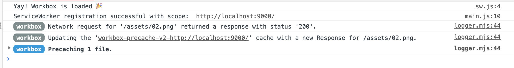 

2 network:和平时访问没有区别，只是加载了一些workbox的依赖

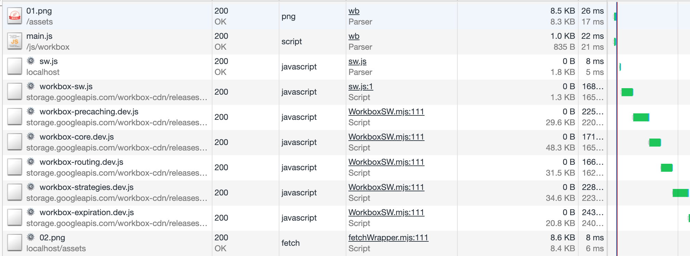

3 appliaction:显示注册的SW信息

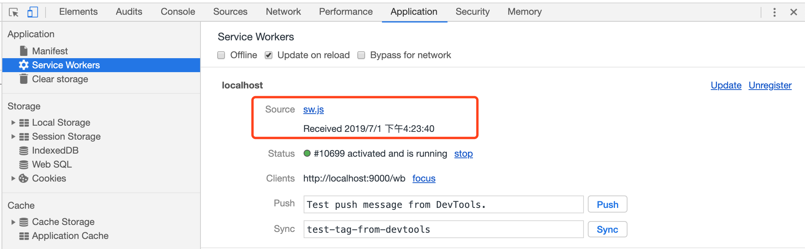

##### 再次刷新

1 console ：

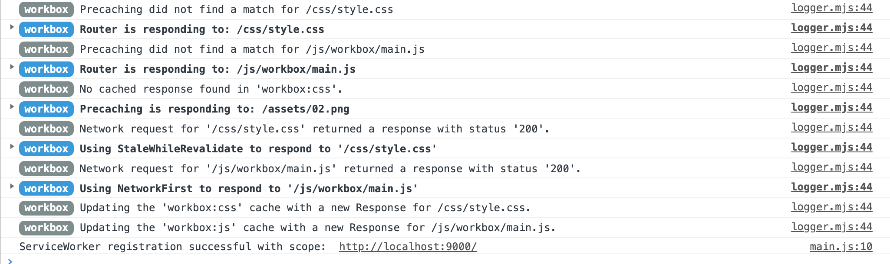

2 network：全部的 css、png、js 文件均被 ServiceWorker 拦截（图中 from ServiceWorker 可以看出）

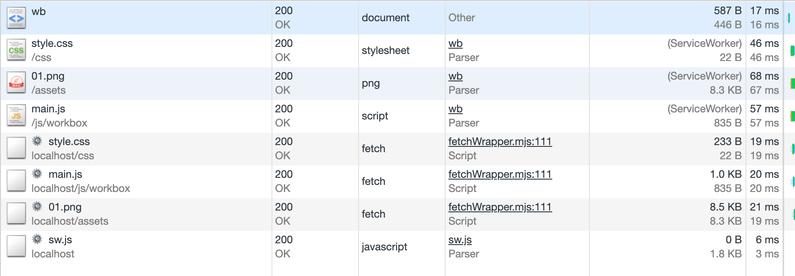


####修改JS和CSS文件后刷新

1 console: 

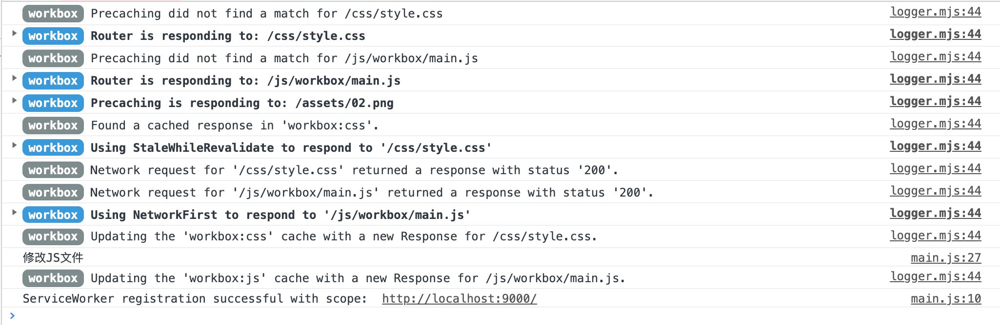

- 由于 png 是 Cache First，所以直接从 ServiceWorker 的 Cache 返回，没有真正的网络请求发出
- 由于 js 是 Network First，所以会产生 fetch，且运行成功（底部 Console 有输出内容）
- css是 StaleWhileRevalidate，虽然同样 fetch 了新的内容，但页面并没有生效，用的还是上一次的 Cache（但新的文件内容已经放到 Cache Storage 中）

[这里](https://zhuanlan.zhihu.com/p/67931226)有相关路由请求和缓存策略详细介绍


页面缓存：

在`sw.js`文件中新增

```
 //主文档: 网络优先
    workbox.routing.registerRoute(
        /.*\wb$/,
        new workbox.strategies.NetworkFirst({
            cacheName: 'workbox:njk',
        })
    );
```

chrome—appliaction-勾选 offline

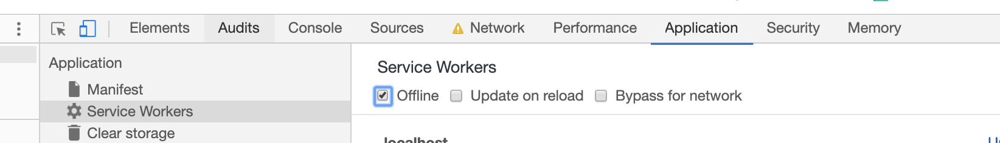

刷新页面

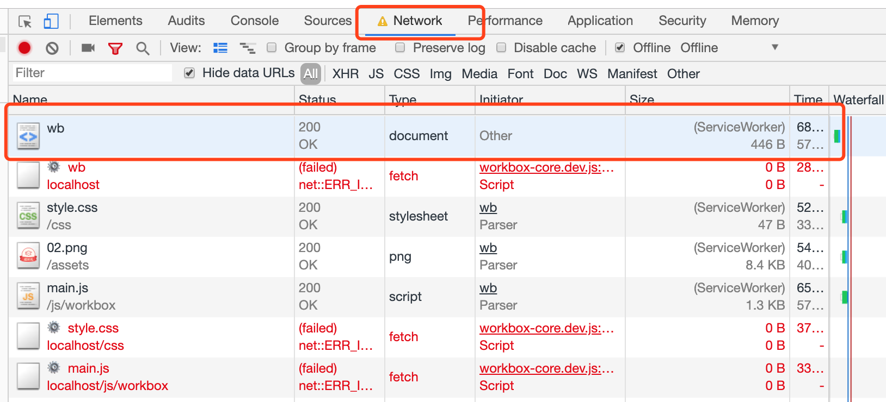

页面正常返回 噢耶！！！

#####一般惯例

``HTML``页面 ：如果希望离线缓存，请使用``NetworkFirst``,如果不需要离线缓存，可以使用``NetworkOnly``或者不设置；

``CSS``,``JS``,``image`` ：跨域的，SW 并没有办法判断请求下来的资源是否正确（HTTP 200），如果缓存错误文件，问题非常严重；所以建议使用``StaleWhileRevalidate``,既可以保证页面速度，即使失败，用户刷新就可以更新；非跨域的，直接使用CacheFirst,并设置一定的失效事件，请求一次就不会再变动了。

 

#####小的知识点

1 只针对运行时缓存

workbox只对“有效的”响应进行缓存，那判断响应的有效性没有统一的标准，开发者可以使用cacheableResponse模块进行自定义“什么是有效的响应”。比如要求返回状态码为[0，200]才是有效的

2

如果希望web应用离线工作，或者有些资产可以被缓存很长时间，那么预缓存是最好的方法。precache将确保在SW之前下载并缓存文件，这意味着如果安装了SW，则会缓存文件。

Workbox提供了一种简单的预缓存文件的方法，确保随着SW的更改，预缓存文件得到有效的维护，只下载更新的文件，并在SW被冗余后进行清理。

```javascript
workbox.precaching.precacheAndRoute([
    '/styles/index.0c9a31.css',
    '/scripts/main.0d5770.js',
    { url: '/index.html', revision: '383676' },
]); 
```

4 PC 浏览器 每个TAB都是一个client ，维护独自的 cache Storage

  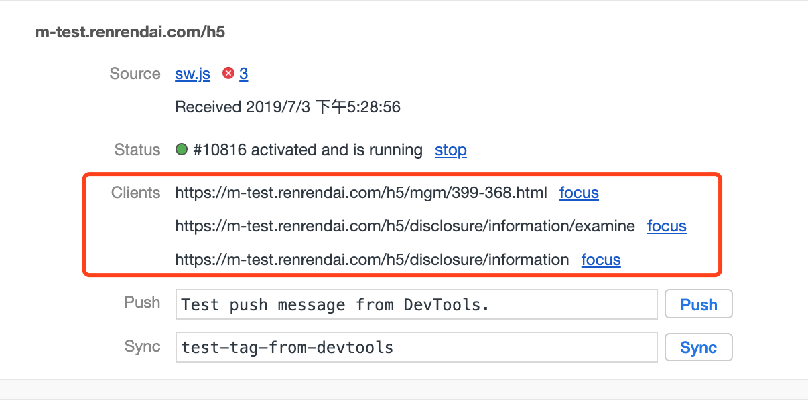

5  不透明响应

跨源请求，但是响应不支持CORS。坚决不可以用 cacheOnly 或者 cacheFirst策略缓存。为什么单独提到这个呢？

`serviceworker`可以拦截作用域下发起的所有请求，包括 **跨越请求** 。通常在缓存静态资源的时候，我们需要确保资源是正确响应的(比如返回http状态码200)，如果返回的是 `404` 或者 `500` 之类的，那么就不应该缓存该资源。但是在 **跨域** 的请求下，默认的 `Request.mode no-cors` 我们 **不能** 读取返回的状态码，也就不知道资源是否OK；因此需要设置跨域资源的 `cors` 属性，比如页面里静态资源，设置 `crossorigin=anonymous` ，这样会触发浏览器发起 `CORS` 请求，也就要求我们的服务器返回header中，增加 `Access-Control-Allow-Origin` 来允许我们跨域访问该资源。如果服务没有增加 `Access-Control-Allow-Origin`，在缓存策略的选取上官方推荐`NetworkFirst`或者`StaleWhileRevalidate`

6  与主线程通信

 通过 postMessage方法

7 容量

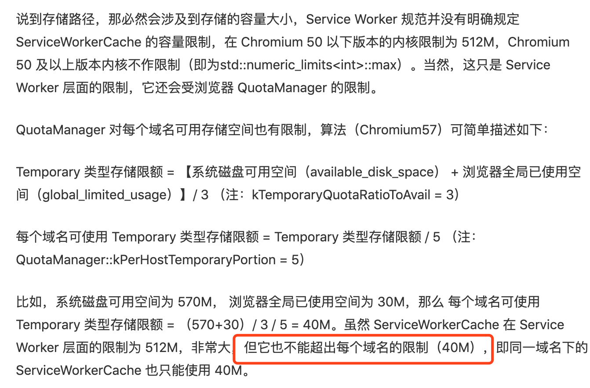

### 其它

消息推送以及通知  后续再聊


参考文档：

[Workbox官网](https://developers.google.com/web/tools/workbox/guides/precache-files/)

[ServiceWorker官网](https://developers.google.com/web/fundamentals/primers/service-workers/lifecycle?hl=zh-cn)

[https://github.com/sophister/2bugua5/blob/master/category/pwa/pwa-speed-up/pwa-speed-up.md#%E8%B7%A8%E5%9F%9F%E8%AF%B7%E6%B1%82](https://github.com/sophister/2bugua5/blob/master/category/pwa/pwa-speed-up/pwa-speed-up.md#跨域请求) by 毛承杰 

https://juejin.im/entry/57f89f938ac2470058ac32c4 by 文蔺

https://juejin.im/post/595233e55188250d9208527c by UC内核发布

### 


